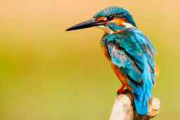

# Is it a bird?


<!-- WARNING: THIS FILE WAS AUTOGENERATED! DO NOT EDIT! -->

The resources related are as following: 1. [Lesson 1
lecture](https://www.youtube.com/watch?v=8SF_h3xF3cE) 2. [Deep Learning
for Coders with Fastai and PyTorch: AI Applications Without a PhD
Chapter
1](https://github.com/fastai/fastbook/blob/master/01_intro.ipynb) 3.
[Course
notebooks](https://github.com/fastai/course22/blob/master/00-is-it-a-bird-creating-a-model-from-your-own-data.ipynb)

``` python
# Suppress only UserWarning
import warnings

warnings.filterwarnings('ignore', category=UserWarning)
```

**Detect if notebook is running on Kaggle**

It’s a good idea to ensure you’re running the latest version of any
libraries you need. `!pip install -Uqq <libraries>` upgrades to the
latest version of <libraries>

``` python
import os
iskaggle = os.environ.get('KAGGLE_KERNEL_RUN_TYPE', '')

if iskaggle:
    print('Is running on Kaggle.')
    !pip install -Uqq fastai
```

## Step 1: Download images of birds and non-birds

``` python
# Skip this cell if you already have duckduckgo_search installed
!pip install -Uqq duckduckgo_search > /dev/null
!pip install -Uqq fastai > /dev/null
!pip install fastdownload  > /dev/null
```

``` python
from duckduckgo_search import DDGS 
from fastcore.all import *

def search_images(keywords, max_images=200): return L(DDGS().images(keywords, max_results=max_images)).itemgot('image')
```

Let’s start by searching for a bird photo and seeing what kind of result
we get. We’ll start by getting URLs from a search:

``` python
# to test, we can run the following code

#urls = search_images('bird photos', max_images=1)
#urls[0]
```

…and then download a URL and take a look at it:

``` python
dest = 'bird.jpg'
bird_path = Path(dest)

if not bird_path.exists():
    from fastdownload import download_url
    download_url(urls[0], dest, show_progress=False)

from fastai.vision.all import *
im = Image.open(dest)
im.to_thumb(256,256)
```



Now let’s do the same with “forest photos”:

``` python
forest_dest= 'forest.jpg'
forest_path = Path(forest_dest)

if not forest_path.exists():
    download_url(search_images('forest photos', max_images=1)[0], forest_dest, show_progress=False)
    
Image.open(forest_dest).to_thumb(256,256)
```


Our searches seem to be giving reasonable results, so let’s grab 200
examples of each of “bird” and “forest” photos, and save each group of
photos to a different folder:

``` python
searches = 'forest','bird'
path = Path('bird_or_not')

for o in searches:
    dest = (path/o)

    if dest.exists():
        print(f"Directory '{dest}' already exists. Skipping search, download, and resize for '{o}'.")
        continue # Skip the rest of this loop iteration and move to the next search term
        
    dest.mkdir(exist_ok=True, parents=True)
    results = search_images(f'{o} photo')
    download_images(dest, urls=results[:200])
    time.sleep(5)
    resize_images(dest, max_size=400, dest=dest)
```

    Directory 'bird_or_not/forest' already exists. Skipping search, download, and resize for 'forest'.
    Directory 'bird_or_not/bird' already exists. Skipping search, download, and resize for 'bird'.

## Step 2: Train our model

Some photos might not download correctly which could cause our model
training to fail, so we’ll remove them:

``` python
failed = verify_images(get_image_files(path))
failed.map(Path.unlink)
len(failed)
```

    0

To train a model, we’ll need `DataLoaders`, which is an object that
contains a training set (the images used to create a model) and a
validation set (the images used to check the accuracy of a model – not
used during training). In `fastai` we can create that easily using a
`DataBlock`, and view sample images from it:

``` python
dls = DataBlock(
    blocks=(ImageBlock, CategoryBlock), 
    get_items=get_image_files, 
    splitter=RandomSplitter(valid_pct=0.2, seed=42),
    get_y=parent_label,
    item_tfms=[Resize(192, method='squish')]
).dataloaders(path, bs=32)

dls.show_batch(max_n=6)
```


``` python
num_bird_photos = len(get_image_files(path/'bird'))
print(f'{num_bird_photos} bird photos exist in dataset')

num_forest_photos = len(get_image_files(path/'forest'))
print(f'{num_forest_photos} forest photos exist in dataset')
```

    185 bird photos exist in dataset
    193 forest photos exist in dataset

Now we’re ready to train our model. The fastest widely used computer
vision model is resnet18. You can train this in a few minutes, even on a
CPU! (On a GPU, it generally takes under 10 seconds…)

`fastai` comes with a helpful `fine_tune()` method which automatically
uses best practices for fine tuning a pre-trained model, so we’ll use
that.

``` python
model_path= Path('bird.pkl')
model_existed=False

if model_path.exists():
    print(f"Loading existing model weights from: {model_path}")
    # Load the saved weights into the existing learner structure
    learn = load_learner('bird.pkl')    
    learn.dls = dls
        
    model_existed=True
else:
    learn = vision_learner(dls, resnet18, metrics=error_rate)
    learn.fine_tune(3)
    model_existed= False
```

    Loading existing model weights from: bird.pkl

## Step 3: Use our model (and build your own!)

Let’s see what our model thinks about that bird we downloaded at the
start:

``` python
is_bird,_,probs = learn.predict(PILImage.create('bird.jpg'))
print(f"This is a: {is_bird}.")
print(f"Probability it's a bird: {probs[0]:.4f}")
```

<style>
    /* Turns off some styling */
    progress {
        /* gets rid of default border in Firefox and Opera. */
        border: none;
        /* Needs to be in here for Safari polyfill so background images work as expected. */
        background-size: auto;
    }
    progress:not([value]), progress:not([value])::-webkit-progress-bar {
        background: repeating-linear-gradient(45deg, #7e7e7e, #7e7e7e 10px, #5c5c5c 10px, #5c5c5c 20px);
    }
    .progress-bar-interrupted, .progress-bar-interrupted::-webkit-progress-bar {
        background: #F44336;
    }
</style>

    This is a: bird.
    Probability it's a bird: 1.0000

``` python
if not model_existed:
    learn.export('bird.pkl')
```
