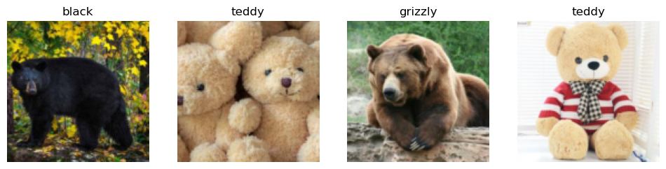
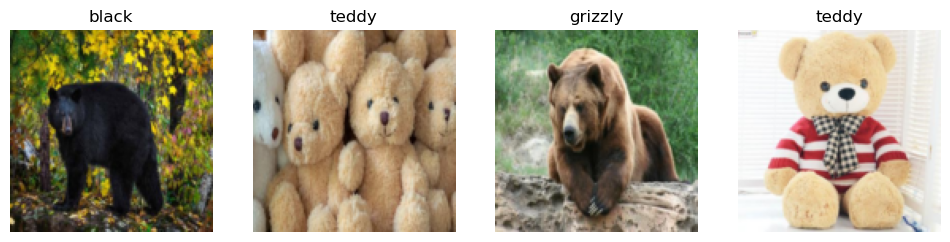
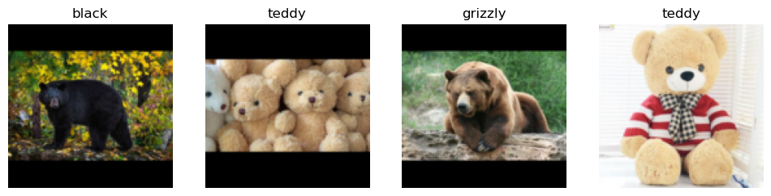
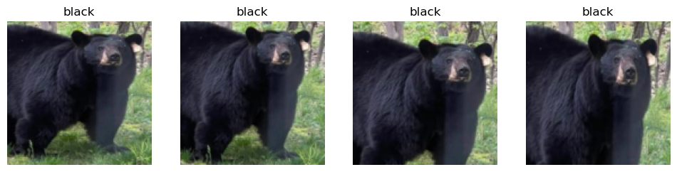
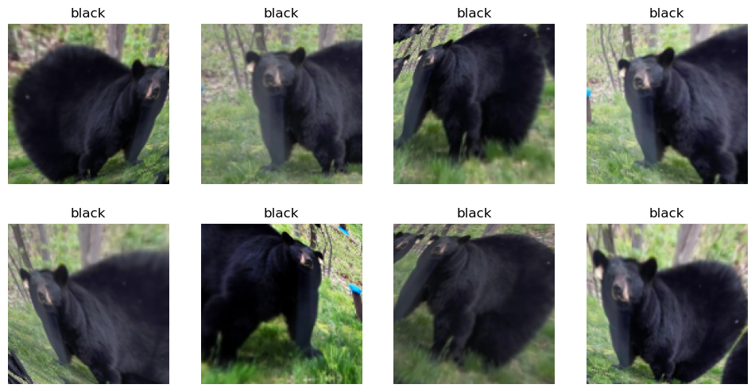
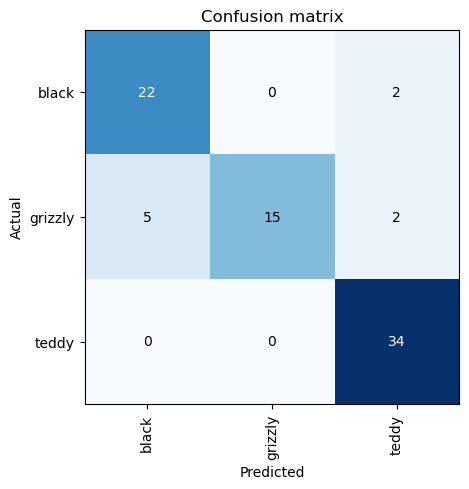
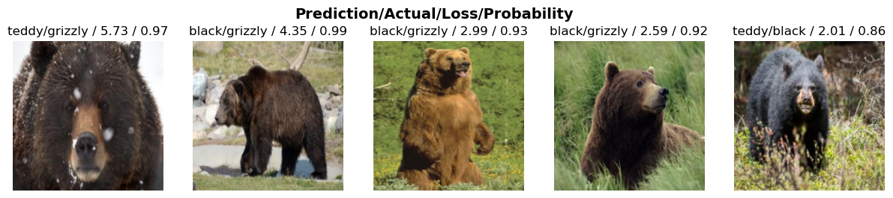

# Saving a bear classifier Model


<!-- WARNING: THIS FILE WAS AUTOGENERATED! DO NOT EDIT! -->

The resources related are as following: 1. [Lesson 2
lecture](https://www.youtube.com/watch?v=F4tvM4Vb3A0) 2. [Deep Learning
for Coders with Fastai and PyTorch: AI Applications Without a PhD
Chapter
2](https://github.com/fastai/fastbook/blob/master/02_production.ipynb)
3. [Course
notebooks](https://github.com/fastai/course22/blob/master/02-saving-a-basic-fastai-model.ipynb)

``` python
# Suppress only UserWarning
import warnings

warnings.filterwarnings('ignore', category=UserWarning)
```

**Detect if notebook is running on Kaggle**

It’s a good idea to ensure you’re running the latest version of any
libraries you need. `!pip install -Uqq <libraries>` upgrades to the
latest version of <libraries>

``` python
import os
iskaggle = os.environ.get('KAGGLE_KERNEL_RUN_TYPE', '')

if iskaggle:
    print('Is running on Kaggle.')
    !pip install -Uqq fastai
```

### The Drivetrain Approach

I found this section very important and wanted to repeat it again from
the book.

There are many accurate models that are of no use to anyone, and many
inaccurate models that are highly useful. To ensure that your modeling
work is useful in practice, you need to consider how your work will be
used. In 2012 Jeremy, along with Margit Zwemer and Mike Loukides,
introduced a method called *the Drivetrain Approach* for thinking about
this issue.

The Drivetrain Approach was described in detail in [“Designing Great
Data
Products”](https://www.oreilly.com/radar/drivetrain-approach-data-products/).
The basic idea is to start with considering your objective, then think
about what actions you can take to meet that objective and what data you
have (or can acquire) that can help, and then build a model that you can
use to determine the best actions to take to get the best results in
terms of your objective.


Consider a model in an autonomous vehicle: you want to help a car drive
safely from point A to point B without human intervention. Great
predictive modeling is an important part of the solution, but it doesn’t
stand on its own; as products become more sophisticated, it disappears
into the plumbing. Someone using a self-driving car is completely
unaware of the hundreds (if not thousands) of models and the petabytes
of data that make it work. But as data scientists build increasingly
sophisticated products, they need a systematic design approach.

We use data not just to generate more data (in the form of predictions),
but to produce *actionable outcomes*. That is the goal of the Drivetrain
Approach. Start by defining a clear *objective*. For instance, Google,
when creating their first search engine, considered “What is the user’s
main objective in typing in a search query?” This led them to their
objective, which was to “show the most relevant search result.” The next
step is to consider what *levers* you can pull (i.e., what actions you
can take) to better achieve that objective. In Google’s case, that was
the ranking of the search results. The third step was to consider what
new *data* they would need to produce such a ranking; they realized that
the implicit information regarding which pages linked to which other
pages could be used for this purpose. Only after these first three steps
do we begin thinking about building the predictive *models*. Our
objective and available levers, what data we already have and what
additional data we will need to collect, determine the models we can
build. The models will take both the levers and any uncontrollable
variables as their inputs; the outputs from the models can be combined
to predict the final state for our objective.

Let’s consider another example: recommendation systems. The *objective*
of a recommendation engine is to drive additional sales by surprising
and delighting the customer with recommendations of items they would not
have purchased without the recommendation. The *lever* is the ranking of
the recommendations. New *data* must be collected to generate
recommendations that will *cause new sales*. This will require
conducting many randomized experiments in order to collect data about a
wide range of recommendations for a wide range of customers. This is a
step that few organizations take; but without it, you don’t have the
information you need to actually optimize recommendations based on your
true objective (more sales!).

Finally, you could build two *models* for purchase probabilities,
conditional on seeing or not seeing a recommendation. The difference
between these two probabilities is a utility function for a given
recommendation to a customer. It will be low in cases where the
algorithm recommends a familiar book that the customer has already
rejected (both components are small) or a book that they would have
bought even without the recommendation (both components are large and
cancel each other out).

As you can see, in practice often the practical implementation of your
models will require a lot more than just training a model! You’ll often
need to run experiments to collect more data, and consider how to
incorporate your models into the overall system you’re developing.
Speaking of data, let’s now focus on how to find data for your project.

## Step 1: Download images of bears

It is the same step as in first lesson with is it a bird classifier.

``` python
# Skip this cell if you already have dependencies installed
!pip install -Uqq duckduckgo_search > /dev/null
!pip install -Uqq fastai  > /dev/null
!pip install fastdownload  > /dev/null
!pip install ipywidgets > /dev/null
```

``` python
from duckduckgo_search import DDGS 
from fastcore.all import *
from fastai.vision.widgets import *

def search_images(keywords, max_images=150): return L(DDGS().images(keywords, max_results=max_images)).itemgot('image')
```

It is a good practice to test each step. So, here we can test 1 bear
image.

``` python
from fastdownload import download_url
from fastai.vision.all import *
from pathlib import Path

teddy_dest = 'teddy_bear.jpg'
teddy_path = Path(teddy_dest)

if not teddy_path.exists():
    download_url(search_images('teddy bear', max_images=1)[0], teddy_dest, show_progress=False)

Image.open(teddy_dest).to_thumb(256,256)
```


This seems to have worked nicely, so let’s use fastai’s
`download_images` to download all the URLs for each of our search terms.
We’ll put each in a separate folder:

``` python
bear_types = 'grizzly','black','teddy'
path = Path('bears')

for o in bear_types:
    dest = (path/o)

    if dest.exists():
        print(f"Directory '{dest}' already exists. Skipping search, download, and resize for '{o}'.")
        continue # Skip the rest of this loop iteration and move to the next search term
        
    dest.mkdir(exist_ok=True, parents=True)
    results = search_images(f'{o} bear')
    download_images(dest, urls=results[:200])
    time.sleep(5)
    resize_images(dest, max_size=400, dest=dest)
```

    Directory 'bears/grizzly' already exists. Skipping search, download, and resize for 'grizzly'.
    Directory 'bears/black' already exists. Skipping search, download, and resize for 'black'.
    Directory 'bears/teddy' already exists. Skipping search, download, and resize for 'teddy'.

## Step 2: Train our model

Some photos might not download correctly which could cause our model
training to fail, so we’ll remove them:

``` python
failed = verify_images(get_image_files(path))
failed.map(Path.unlink)
len(failed)
```

    0

I like Jeremy’s approach which he starts training the model quickly and
then optimizes for the quick and easy iterations and improvement. He
starts by training the base model and uses then uses that for
identifying the data issues in dataset. This approach simplifies the
data cleaning by tone. It makes the data cleaning and augumentation
straightforward and intuitive rather than abstract and scary.

That is why in the lecture, he imetiately trains the model with the
minimum tricks as the baseline.

``` python
bears = DataBlock(
    blocks=(ImageBlock, CategoryBlock), 
    get_items=get_image_files, 
    splitter=RandomSplitter(valid_pct=0.2, seed=42),
    get_y=parent_label,
    item_tfms=Resize(128))
```

There are different resize methods which they influence the image
representations.

By default `Resize` crops the images to fit a square shape of the size
requested, using the full width or height. This can result in losing
some important details.

``` python
bears = bears.new(item_tfms=Resize(128, ResizeMethod.Crop))
dls = bears.dataloaders(path)
dls.valid.show_batch(max_n=4, nrows=1)
```



Alternatively, you can ask fastai to squish/stretch them:

``` python
bears = bears.new(item_tfms=Resize(128, ResizeMethod.Squish))
dls = bears.dataloaders(path)
dls.valid.show_batch(max_n=4, nrows=1)
```



Or ask fastai to pad the images with zeros (black):

``` python
bears = bears.new(item_tfms=Resize(128, ResizeMethod.Pad, pad_mode='zeros'))
dls = bears.dataloaders(path)
dls.valid.show_batch(max_n=4, nrows=1)
```



Here’s another example where we replace `Resize` with
`RandomResizedCrop`, which is the transform that provides the behavior
we just described. The most important parameter to pass in is
`min_scale`, which determines how much of the image to select at minimum
each time:

``` python
bears = bears.new(item_tfms=RandomResizedCrop(128, min_scale=0.3))
dls = bears.dataloaders(path)
dls.train.show_batch(max_n=4, nrows=1, unique=True)
```



## Data Augmentation

Data augmentation refers to creating random variations of our input
data, such that they appear different, but do not actually change the
meaning of the data. Examples of common data augmentation techniques for
images are rotation, flipping, perspective warping, brightness changes
and contrast changes. For natural photo images such as the ones we are
using here, a standard set of augmentations that we have found work
pretty well are provided with the `aug_transforms` function. Because our
images are now all the same size, we can apply these augmentations to an
entire batch of them using the GPU, which will save a lot of time. To
tell fastai we want to use these transforms on a batch, we use the
`batch_tfms` parameter (note that we’re not using `RandomResizedCrop` in
this example, so you can see the differences more clearly; we’re also
using double the amount of augmentation compared to the default, for the
same reason):

``` python
bears = bears.new(item_tfms=Resize(128), batch_tfms=aug_transforms(mult=2))
dls = bears.dataloaders(path)
dls.train.show_batch(max_n=8, nrows=2, unique=True)
```



## Train our model

Time to use the same lines of code as in first notebook to train our
bear classifier.

We don’t have a lot of data for our problem (150 pictures of each sort
of bear at most), so to train our model, we’ll use `RandomResizedCrop`
with an image size of 224 px, which is fairly standard for image
classification, and default `aug_transforms`:

``` python
bears = bears.new(
    item_tfms=RandomResizedCrop(224, min_scale=0.5),
    batch_tfms=aug_transforms())
dls = bears.dataloaders(path)
```

We can now create our `Learner` and fine-tune it in the usual way:

``` python
# Check if the model is trained before, we just load it.
model_path= Path('bear.pkl')
model_existed=False

if model_path.exists():
    print(f"Loading existing model weights from: {model_path}")
    # Load the saved weights into the existing learner structure
    learn = load_learner('bear.pkl')    
    learn.dls = dls
        
    model_existed=True
else:
    learn = vision_learner(dls, resnet18, metrics=error_rate)
    learn.fine_tune(4)
    model_existed= False
```

    Loading existing model weights from: bear.pkl

## Investigate the model

In order to analyze the mistakes that model is making, one way is
visualizing it. To visualize this, we can create a *confusion matrix*:

``` python
interp = ClassificationInterpretation.from_learner(learn)
interp.plot_confusion_matrix()
```

<style>
    /* Turns off some styling */
    progress {
        /* gets rid of default border in Firefox and Opera. */
        border: none;
        /* Needs to be in here for Safari polyfill so background images work as expected. */
        background-size: auto;
    }
    progress:not([value]), progress:not([value])::-webkit-progress-bar {
        background: repeating-linear-gradient(45deg, #7e7e7e, #7e7e7e 10px, #5c5c5c 10px, #5c5c5c 20px);
    }
    .progress-bar-interrupted, .progress-bar-interrupted::-webkit-progress-bar {
        background: #F44336;
    }
</style>

<style>
    /* Turns off some styling */
    progress {
        /* gets rid of default border in Firefox and Opera. */
        border: none;
        /* Needs to be in here for Safari polyfill so background images work as expected. */
        background-size: auto;
    }
    progress:not([value]), progress:not([value])::-webkit-progress-bar {
        background: repeating-linear-gradient(45deg, #7e7e7e, #7e7e7e 10px, #5c5c5c 10px, #5c5c5c 20px);
    }
    .progress-bar-interrupted, .progress-bar-interrupted::-webkit-progress-bar {
        background: #F44336;
    }
</style>



The rows represent all the black, grizzly, and teddy bears in our
dataset, respectively. The columns represent the images which the model
predicted as black, grizzly, and teddy bears, respectively. Therefore,
the diagonal of the matrix shows the images which were classified
correctly, and the off-diagonal cells represent those which were
classified incorrectly. This is one of the many ways that fastai allows
you to view the results of your model. It is (of course!) calculated
using the validation set. With the color-coding, the goal is to have
white everywhere except the diagonal, where we want dark blue. Our bear
classifier isn’t making many mistakes!

It’s helpful to see where exactly our errors are occurring, to see
whether they’re due to a dataset problem (e.g., images that aren’t bears
at all, or are labeled incorrectly, etc.), or a model problem (perhaps
it isn’t handling images taken with unusual lighting, or from a
different angle, etc.). To do this, we can sort our images by their
loss.

The loss is a number that is higher if the model is incorrect
(especially if it’s also confident of its incorrect answer), or if it’s
correct, but not confident of its correct answer. In a couple of
chapters we’ll learn in depth how loss is calculated and used in the
training process. For now, `plot_top_losses` shows us the images with
the highest loss in our dataset. As the title of the output says, each
image is labeled with four things: prediction, actual (target label),
loss, and probability. The probability here is the confidence level,
from zero to one, that the model has assigned to its prediction:

``` python
interp.plot_top_losses(5, nrows=1)
```

<style>
    /* Turns off some styling */
    progress {
        /* gets rid of default border in Firefox and Opera. */
        border: none;
        /* Needs to be in here for Safari polyfill so background images work as expected. */
        background-size: auto;
    }
    progress:not([value]), progress:not([value])::-webkit-progress-bar {
        background: repeating-linear-gradient(45deg, #7e7e7e, #7e7e7e 10px, #5c5c5c 10px, #5c5c5c 20px);
    }
    .progress-bar-interrupted, .progress-bar-interrupted::-webkit-progress-bar {
        background: #F44336;
    }
</style>



The intuitive approach to doing data cleaning is to do it before you
train a model. But as you’ve seen in this case, a model can actually
help you find data issues more quickly and easily. So, we normally
prefer to train a quick and simple model first, and then use it to help
us with data cleaning.

fastai includes a handy GUI for data cleaning called
`ImageClassifierCleaner` that allows you to choose a category and the
training versus validation set and view the highest-loss images (in
order), along with menus to allow images to be selected for removal or
relabeling:

``` python
#hide_output
if not model_existed:
    cleaner = ImageClassifierCleaner(learn)
    cleaner
```

## Turning the Model into an Online Application

### Using the Model for Inference

Once you’ve got a model you’re happy with, you need to save it, so that
you can then copy it over to a server where you’ll use it in production.
Remember that a model consists of two parts: the *architecture* and the
trained *parameters*. The easiest way to save the model is to save both
of these, because that way when you load a model you can be sure that
you have the matching architecture and parameters. To save both parts,
use the `export` method.

This method even saves the definition of how to create your
`DataLoaders`. This is important, because otherwise you would have to
redefine how to transform your data in order to use your model in
production. fastai automatically uses your validation set `DataLoader`
for inference by default, so your data augmentation will not be applied,
which is generally what you want.

When you call `export`, fastai will save a file called “export.pkl”:

``` python
if not model_existed:
    learn.export('bear.pkl')
```

For now, let’s try to create a simple app within our notebook.

When we use a model for getting predictions, instead of training, we
call it *inference*. To create our inference learner from the exported
file, we use `load_learner` (in this case, this isn’t really necessary,
since we already have a working `Learner` in our notebook; we’re just
doing for demonstrating the end-to-end process):

``` python
if model_existed:    
    learn_inf = learn
else:
    learn_inf = load_learner('bear.pkl')
```

When we’re doing inference, we’re generally just getting predictions for
one image at a time. To do this, pass a filename to `predict`:

``` python
learn_inf.predict('teddy_bear.jpg')
```

<style>
    /* Turns off some styling */
    progress {
        /* gets rid of default border in Firefox and Opera. */
        border: none;
        /* Needs to be in here for Safari polyfill so background images work as expected. */
        background-size: auto;
    }
    progress:not([value]), progress:not([value])::-webkit-progress-bar {
        background: repeating-linear-gradient(45deg, #7e7e7e, #7e7e7e 10px, #5c5c5c 10px, #5c5c5c 20px);
    }
    .progress-bar-interrupted, .progress-bar-interrupted::-webkit-progress-bar {
        background: #F44336;
    }
</style>

    ('teddy', tensor(2), tensor([4.8577e-08, 9.9890e-08, 1.0000e+00]))

This has returned three things: the predicted category in the same
format you originally provided (in this case that’s a string), the index
of the predicted category, and the probabilities of each category. The
last two are based on the order of categories in the *vocab* of the
`DataLoaders`; that is, the stored list of all possible categories. At
inference time, you can access the `DataLoaders` as an attribute of the
`Learner`:

``` python
learn_inf.dls.vocab
```

    ['black', 'grizzly', 'teddy']

We can see here that if we index into the vocab with the integer
returned by `predict` then we get back “teddy,” as expected. Also, note
that if we index into the list of probabilities, we see a nearly 1.00
probability that this is a teddy bear.

We know how to make predictions from our saved model, so we have
everything we need to start building our app. We can do it directly in a
Jupyter notebook.

### Creating a Notebook App from the Model

To use our model in an application, we can simply treat the `predict`
method as a regular function. Therefore, creating an app from the model
can be done using any of the myriad of frameworks and techniques
available to application developers.

However, most data scientists are not familiar with the world of web
application development. So let’s try using something that you do, at
this point, know: it turns out that we can create a complete working web
application using nothing but Jupyter notebooks!

- IPython widgets (ipywidgets)

*IPython widgets* are GUI components that bring together JavaScript and
Python functionality in a web browser, and can be created and used
within a Jupyter notebook. For instance, the image cleaner that we saw
earlier in this chapter is entirely written with IPython widgets.
However, we don’t want to require users of our application to run
Jupyter themselves.

But we still have the advantage of developing in a notebook, so with
ipywidgets, we can build up our GUI step by step. We will use this
approach to create a simple image classifier. First, we need a file
upload widget:

``` python
btn_upload = widgets.FileUpload(accept='image/*', multiple=False)
btn_run = widgets.Button(description='Classify')
out_pl = widgets.Output()
lbl_pred = widgets.Label()

def on_click_classify(change):
    img = None
    if not btn_upload.value:
        out_pl.clear_output()
        with out_pl:
            print("Please upload an image first.")
        lbl_pred.value = ""
        return

    try:        
        uploaded_file_info = btn_upload.value[0]        
        image_content_memoryview = uploaded_file_info['content']
        
        image_bytes = image_content_memoryview.tobytes()        
        img = PILImage.create(image_bytes)

    except Exception as e:
        out_pl.clear_output()
        with out_pl:
            print(f"Error loading image: {e}")
        lbl_pred.value = ""
        return
    
    out_pl.clear_output()
    with out_pl:
        display(img.to_thumb(128,128))

    pred, pred_idx, probs = learn_inf.predict(img)   
    lbl_pred.value = f'Prediction: {pred}; Probability: {probs[pred_idx]:.04f}'

btn_run.on_click(on_click_classify)

display(widgets.VBox([widgets.Label('Select your bear!'),
                      btn_upload, btn_run, out_pl, lbl_pred]))
```

    VBox(children=(Label(value='Select your bear!'), FileUpload(value=(), accept='image/*', description='Upload'),…

## Serving model in Hugging face Space

This is a quick and easy way to serve the model for testing and serve it
as Prototype. Mostly it can be free as the model can be served using
free CPU. There is a good integration with Gradio UI which makes it
easier.

I pushed the model to this space: [Bear
Classifier](https://huggingface.co/spaces/continuouslearnerforever/fastai-bear-classifier)

I found it very smooth and delightful experience of training the model
and inspecting it. Then I prefer to serve it using `Gradio UI` for
testing and verification as Prototype rather than using
`IPython widgets`.

Serving the model via HF, has another advantage that simply it will be
available via API. This is useful especially if the plan is to
integerate the model serving inside an existing application or integrate
it in a modern frontend application.

## How to Avoid Disaster

I found this section very important and wanted to repeat it again from
the book.

In practice, a deep learning model will be just one piece of a much
bigger system. As we discussed at the start of this chapter, a data
product requires thinking about the entire end-to-end process, from
conception to use in production. In this book, we can’t hope to cover
all the complexity of managing deployed data products, such as managing
multiple versions of models, A/B testing, canarying, refreshing the data
(should we just grow and grow our datasets all the time, or should we
regularly remove some of the old data?), handling data labeling,
monitoring all this, detecting model rot, and so forth. In this section
we will give an overview of some of the most important issues to
consider; for a more detailed discussion of deployment issues we refer
to you to the excellent [Building Machine Learning Powered
Applications](http://shop.oreilly.com/product/0636920215912.do) by
Emmanuel Ameisen (O’Reilly)

One of the biggest issues to consider is that understanding and testing
the behavior of a deep learning model is much more difficult than with
most other code you write. With normal software development you can
analyze the exact steps that the software is taking, and carefully study
which of these steps match the desired behavior that you are trying to
create. But with a neural network the behavior emerges from the model’s
attempt to match the training data, rather than being exactly defined.

This can result in disaster! For instance, let’s say we really were
rolling out a bear detection system that will be attached to video
cameras around campsites in national parks, and will warn campers of
incoming bears. If we used a model trained with the dataset we
downloaded there would be all kinds of problems in practice, such as:

- Working with video data instead of images
- Handling nighttime images, which may not appear in this dataset
- Dealing with low-resolution camera images
- Ensuring results are returned fast enough to be useful in practice
- Recognizing bears in positions that are rarely seen in photos that
  people post online (for example from behind, partially covered by
  bushes, or when a long way away from the camera)

A big part of the issue is that the kinds of photos that people are most
likely to upload to the internet are the kinds of photos that do a good
job of clearly and artistically displaying their subject matter—which
isn’t the kind of input this system is going to be getting. So, we may
need to do a lot of our own data collection and labelling to create a
useful system.

This is just one example of the more general problem of *out-of-domain*
data. That is to say, there may be data that our model sees in
production which is very different to what it saw during training. There
isn’t really a complete technical solution to this problem; instead, we
have to be careful about our approach to rolling out the technology.

There are other reasons we need to be careful too. One very common
problem is *domain shift*, where the type of data that our model sees
changes over time. For instance, an insurance company may use a deep
learning model as part of its pricing and risk algorithm, but over time
the types of customers that the company attracts, and the types of risks
they represent, may change so much that the original training data is no
longer relevant.

Out-of-domain data and domain shift are examples of a larger problem:
that you can never fully understand the entire behaviour of your neural
network. They have far too many parameters to be able to analytically
understand all of their possible behaviors. This is the natural downside
of their best feature—their flexibility, which enables them to solve
complex problems where we may not even be able to fully specify our
preferred solution approaches. The good news, however, is that there are
ways to mitigate these risks using a carefully thought-out process. The
details of this will vary depending on the details of the problem you
are solving, but we will attempt to lay out here a high-level approach,
summarized in \<<deploy_process>\>, which we hope will provide useful
guidance.


Where possible, the first step is to use an entirely manual process,
with your deep learning model approach running in parallel but not being
used directly to drive any actions. The humans involved in the manual
process should look at the deep learning outputs and check whether they
make sense. For instance, with our bear classifier a park ranger could
have a screen displaying video feeds from all the cameras, with any
possible bear sightings simply highlighted in red. The park ranger would
still be expected to be just as alert as before the model was deployed;
the model is simply helping to check for problems at this point.

The second step is to try to limit the scope of the model, and have it
carefully supervised by people. For instance, do a small geographically
and time-constrained trial of the model-driven approach. Rather than
rolling our bear classifier out in every national park throughout the
country, we could pick a single observation post, for a one-week period,
and have a park ranger check each alert before it goes out.

Then, gradually increase the scope of your rollout. As you do so, ensure
that you have really good reporting systems in place, to make sure that
you are aware of any significant changes to the actions being taken
compared to your manual process. For instance, if the number of bear
alerts doubles or halves after rollout of the new system in some
location, we should be very concerned. Try to think about all the ways
in which your system could go wrong, and then think about what measure
or report or picture could reflect that problem, and ensure that your
regular reporting includes that information.

### Unforeseen Consequences and Feedback Loops

One of the biggest challenges in rolling out a model is that your model
may change the behaviour of the system it is a part of. For instance,
consider a “predictive policing” algorithm that predicts more crime in
certain neighborhoods, causing more police officers to be sent to those
neighborhoods, which can result in more crimes being recorded in those
neighborhoods, and so on. In the Royal Statistical Society paper [“To
Predict and
Serve?”](https://rss.onlinelibrary.wiley.com/doi/full/10.1111/j.1740-9713.2016.00960.x),
Kristian Lum and William Isaac observe that: “predictive policing is
aptly named: it is predicting future policing, not future crime.”

Part of the issue in this case is that in the presence of bias (which
we’ll discuss in depth in the next chapter), *feedback loops* can result
in negative implications of that bias getting worse and worse. For
instance, there are concerns that this is already happening in the US,
where there is significant bias in arrest rates on racial grounds.
[According to the
ACLU](https://www.aclu.org/issues/smart-justice/sentencing-reform/war-marijuana-black-and-white),
“despite roughly equal usage rates, Blacks are 3.73 times more likely
than whites to be arrested for marijuana.” The impact of this bias,
along with the rollout of predictive policing algorithms in many parts
of the US, led Bärí Williams to [write in the *New York
Times*](https://www.nytimes.com/2017/12/02/opinion/sunday/intelligent-policing-and-my-innocent-children.html):
“The same technology that’s the source of so much excitement in my
career is being used in law enforcement in ways that could mean that in
the coming years, my son, who is 7 now, is more likely to be profiled or
arrested—or worse—for no reason other than his race and where we live.”

A helpful exercise prior to rolling out a significant machine learning
system is to consider this question: “What would happen if it went
really, really well?” In other words, what if the predictive power was
extremely high, and its ability to influence behavior was extremely
significant? In that case, who would be most impacted? What would the
most extreme results potentially look like? How would you know what was
really going on?

Such a thought exercise might help you to construct a more careful
rollout plan, with ongoing monitoring systems and human oversight. Of
course, human oversight isn’t useful if it isn’t listened to, so make
sure that there are reliable and resilient communication channels so
that the right people will be aware of issues, and will have the power
to fix them.
