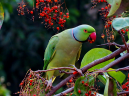
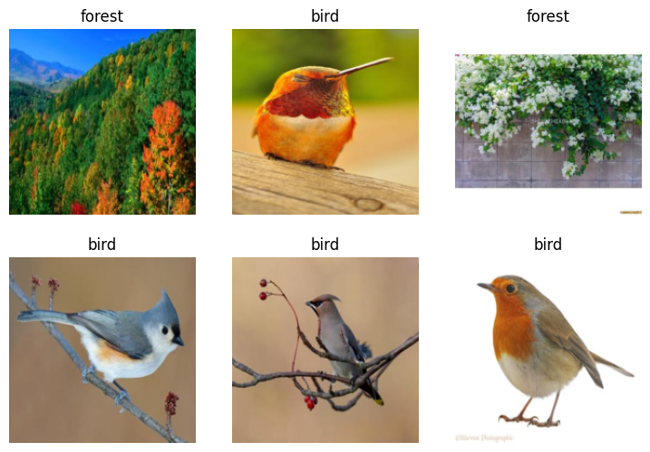

<!-- WARNING: THIS FILE WAS AUTOGENERATED! DO NOT EDIT! -->

The resources related are as following:
1. [Lesson 1 lecture](https://www.youtube.com/watch?v=8SF_h3xF3cE)
2. [Deep Learning for Coders with Fastai and PyTorch: AI Applications Without a PhD Chapter 1](https://github.com/fastai/fastbook/blob/master/01_intro.ipynb)
3. [Course notebooks](https://github.com/fastai/course22/blob/master/00-is-it-a-bird-creating-a-model-from-your-own-data.ipynb)

**Detect if notebook is running on Kaggle**

It's a good idea to ensure you're running the latest version of any libraries you need.
`!pip install -Uqq <libraries>` upgrades to the latest version of <libraries>

::: {#cell-4 .cell}
``` {.python .cell-code}
import os
iskaggle = os.environ.get('KAGGLE_KERNEL_RUN_TYPE', '')

if iskaggle:
    print('Is running on Kaggle.')
    !pip install -Uqq fastai
```
:::


## Step 1: Download images of birds and non-birds

::: {#cell-6 .cell}
``` {.python .cell-code}
# Skip this cell if you already have duckduckgo_search installed
!pip install -Uqq duckduckgo_search
!pip install -Uqq fastai
!pip install fastdownload
```

::: {.cell-output .cell-output-stdout}
```
Requirement already satisfied: fastdownload in /home/jafar/miniconda3/lib/python3.12/site-packages (0.0.7)
Requirement already satisfied: fastprogress in /home/jafar/miniconda3/lib/python3.12/site-packages (from fastdownload) (1.0.3)
Requirement already satisfied: fastcore>=1.3.26 in /home/jafar/miniconda3/lib/python3.12/site-packages (from fastdownload) (1.7.29)
Requirement already satisfied: packaging in /home/jafar/miniconda3/lib/python3.12/site-packages (from fastcore>=1.3.26->fastdownload) (24.2)
```
:::
:::


::: {#cell-7 .cell}
``` {.python .cell-code}
from duckduckgo_search import DDGS 
from fastcore.all import *

def search_images(keywords, max_images=200): return L(DDGS().images(keywords, max_results=max_images)).itemgot('image')
```
:::


Let's start by searching for a bird photo and seeing what kind of result we get. We'll start by getting URLs from a search:

::: {#cell-9 .cell}
``` {.python .cell-code}
urls = search_images('bird photos', max_images=1)
urls[0]
```

::: {.cell-output .cell-output-display}
```
'https://images.pexels.com/photos/97533/pexels-photo-97533.jpeg?cs=srgb&dl=animal-avian-bird-97533.jpg&fm=jpg'
```
:::
:::


...and then download a URL and take a look at it:

::: {#cell-11 .cell}
``` {.python .cell-code}
from fastdownload import download_url
dest = 'bird.jpg'
download_url(urls[0], dest, show_progress=False)

from fastai.vision.all import *
im = Image.open(dest)
im.to_thumb(256,256)
```

::: {.cell-output .cell-output-display}
{}
:::
:::


Now let's do the same with "forest photos":

::: {#cell-13 .cell}
``` {.python .cell-code}
download_url(search_images('forest photos', max_images=1)[0], 'forest.jpg', show_progress=False)
Image.open('forest.jpg').to_thumb(256,256)
```

::: {.cell-output .cell-output-display}
{}
:::
:::


Our searches seem to be giving reasonable results, so let's grab 200 examples of each of "bird" and "forest" photos, and save each group of photos to a different folder:

::: {#cell-15 .cell}
``` {.python .cell-code}
searches = 'forest','bird'
path = Path('bird_or_not')

for o in searches:
    dest = (path/o)

    if dest.exists():
        print(f"Directory '{dest}' already exists. Skipping search, download, and resize for '{o}'.")
        continue # Skip the rest of this loop iteration and move to the next search term
        
    dest.mkdir(exist_ok=True, parents=True)
    results = search_images(f'{o} photo')
    download_images(dest, urls=results[:200])
    time.sleep(5)
    resize_images(dest, max_size=400, dest=dest)
```

::: {.cell-output .cell-output-stdout}
```
Directory 'bird_or_not/forest' already exists. Skipping search, download, and resize for 'forest'.
Directory 'bird_or_not/bird' already exists. Skipping search, download, and resize for 'bird'.
```
:::
:::


## Step 2: Train our model
Some photos might not download correctly which could cause our model training to fail, so we'll remove them:

::: {#cell-17 .cell}
``` {.python .cell-code}
failed = verify_images(get_image_files(path))
failed.map(Path.unlink)
len(failed)
```

::: {.cell-output .cell-output-stderr}
```
/home/jafar/.local/lib/python3.10/site-packages/PIL/Image.py:3570: UserWarning: image file could not be identified because AVIF support not installed
  warnings.warn(message)
/home/jafar/.local/lib/python3.10/site-packages/PIL/Image.py:3570: UserWarning: image file could not be identified because AVIF support not installed
  warnings.warn(message)
/home/jafar/.local/lib/python3.10/site-packages/PIL/Image.py:3570: UserWarning: image file could not be identified because AVIF support not installed
  warnings.warn(message)
/home/jafar/.local/lib/python3.10/site-packages/PIL/Image.py:3570: UserWarning: image file could not be identified because AVIF support not installed
  warnings.warn(message)
/home/jafar/.local/lib/python3.10/site-packages/PIL/Image.py:3570: UserWarning: image file could not be identified because AVIF support not installed
  warnings.warn(message)
/home/jafar/.local/lib/python3.10/site-packages/PIL/Image.py:3570: UserWarning: image file could not be identified because AVIF support not installed
  warnings.warn(message)
/home/jafar/.local/lib/python3.10/site-packages/PIL/Image.py:3570: UserWarning: image file could not be identified because AVIF support not installed
  warnings.warn(message)
/home/jafar/.local/lib/python3.10/site-packages/PIL/Image.py:3570: UserWarning: image file could not be identified because AVIF support not installed
  warnings.warn(message)
/home/jafar/.local/lib/python3.10/site-packages/PIL/Image.py:3570: UserWarning: image file could not be identified because AVIF support not installed
  warnings.warn(message)
```
:::

::: {.cell-output .cell-output-display}
```
14
```
:::
:::


To train a model, we'll need `DataLoaders`, which is an object that contains a training set (the images used to create a model) and a validation set (the images used to check the accuracy of a model -- not used during training). In `fastai` we can create that easily using a `DataBlock`, and view sample images from it:

::: {#cell-19 .cell}
``` {.python .cell-code}
dls = DataBlock(
    blocks=(ImageBlock, CategoryBlock), 
    get_items=get_image_files, 
    splitter=RandomSplitter(valid_pct=0.2, seed=42),
    get_y=parent_label,
    item_tfms=[Resize(192, method='squish')]
).dataloaders(path, bs=32)

dls.show_batch(max_n=6)
```

::: {.cell-output .cell-output-display}
{}
:::
:::


::: {#cell-20 .cell}
``` {.python .cell-code}
num_bird_photos = len(get_image_files(path/'bird'))
print(f'{num_bird_photos} bird photos exist in dataset')

num_forest_photos = len(get_image_files(path/'forest'))
print(f'{num_forest_photos} forest photos exist in dataset')
```

::: {.cell-output .cell-output-stdout}
```
186 bird photos exist in dataset
183 forest photos exist in dataset
```
:::
:::


Now we're ready to train our model. The fastest widely used computer vision model is resnet18. You can train this in a few minutes, even on a CPU! (On a GPU, it generally takes under 10 seconds...)

`fastai` comes with a helpful `fine_tune()` method which automatically uses best practices for fine tuning a pre-trained model, so we'll use that.

::: {#cell-22 .cell}
``` {.python .cell-code}
learn = vision_learner(dls, resnet18, metrics=error_rate)
learn.fine_tune(3)
```

::: {.cell-output .cell-output-display}

```{=html}

<style>
    /* Turns off some styling */
    progress {
        /* gets rid of default border in Firefox and Opera. */
        border: none;
        /* Needs to be in here for Safari polyfill so background images work as expected. */
        background-size: auto;
    }
    progress:not([value]), progress:not([value])::-webkit-progress-bar {
        background: repeating-linear-gradient(45deg, #7e7e7e, #7e7e7e 10px, #5c5c5c 10px, #5c5c5c 20px);
    }
    .progress-bar-interrupted, .progress-bar-interrupted::-webkit-progress-bar {
        background: #F44336;
    }
</style>
```

:::

::: {.cell-output .cell-output-display}

```{=html}
<table border="1" class="dataframe">
  <thead>
    <tr style="text-align: left;">
      <th>epoch</th>
      <th>train_loss</th>
      <th>valid_loss</th>
      <th>error_rate</th>
      <th>time</th>
    </tr>
  </thead>
  <tbody>
    <tr>
      <td>0</td>
      <td>0.455893</td>
      <td>0.168887</td>
      <td>0.095890</td>
      <td>01:14</td>
    </tr>
  </tbody>
</table>
```

:::

::: {.cell-output .cell-output-display}

```{=html}

<style>
    /* Turns off some styling */
    progress {
        /* gets rid of default border in Firefox and Opera. */
        border: none;
        /* Needs to be in here for Safari polyfill so background images work as expected. */
        background-size: auto;
    }
    progress:not([value]), progress:not([value])::-webkit-progress-bar {
        background: repeating-linear-gradient(45deg, #7e7e7e, #7e7e7e 10px, #5c5c5c 10px, #5c5c5c 20px);
    }
    .progress-bar-interrupted, .progress-bar-interrupted::-webkit-progress-bar {
        background: #F44336;
    }
</style>
```

:::

::: {.cell-output .cell-output-display}

```{=html}
<table border="1" class="dataframe">
  <thead>
    <tr style="text-align: left;">
      <th>epoch</th>
      <th>train_loss</th>
      <th>valid_loss</th>
      <th>error_rate</th>
      <th>time</th>
    </tr>
  </thead>
  <tbody>
    <tr>
      <td>0</td>
      <td>0.040055</td>
      <td>0.001052</td>
      <td>0.000000</td>
      <td>01:05</td>
    </tr>
    <tr>
      <td>1</td>
      <td>0.025476</td>
      <td>0.000178</td>
      <td>0.000000</td>
      <td>01:23</td>
    </tr>
    <tr>
      <td>2</td>
      <td>0.017576</td>
      <td>0.000412</td>
      <td>0.000000</td>
      <td>01:03</td>
    </tr>
  </tbody>
</table>
```

:::
:::


## Step 3: Use our model (and build your own!)

Let's see what our model thinks about that bird we downloaded at the start:

::: {#cell-24 .cell}
``` {.python .cell-code}
is_bird,_,probs = learn.predict(PILImage.create('bird.jpg'))
print(f"This is a: {is_bird}.")
print(f"Probability it's a bird: {probs[0]:.4f}")
```

::: {.cell-output .cell-output-display}

```{=html}

<style>
    /* Turns off some styling */
    progress {
        /* gets rid of default border in Firefox and Opera. */
        border: none;
        /* Needs to be in here for Safari polyfill so background images work as expected. */
        background-size: auto;
    }
    progress:not([value]), progress:not([value])::-webkit-progress-bar {
        background: repeating-linear-gradient(45deg, #7e7e7e, #7e7e7e 10px, #5c5c5c 10px, #5c5c5c 20px);
    }
    .progress-bar-interrupted, .progress-bar-interrupted::-webkit-progress-bar {
        background: #F44336;
    }
</style>
```

:::

::: {.cell-output .cell-output-display}

```{=html}

```

:::

::: {.cell-output .cell-output-stdout}
```
This is a: bird.
Probability it's a bird: 1.0000
```
:::
:::


